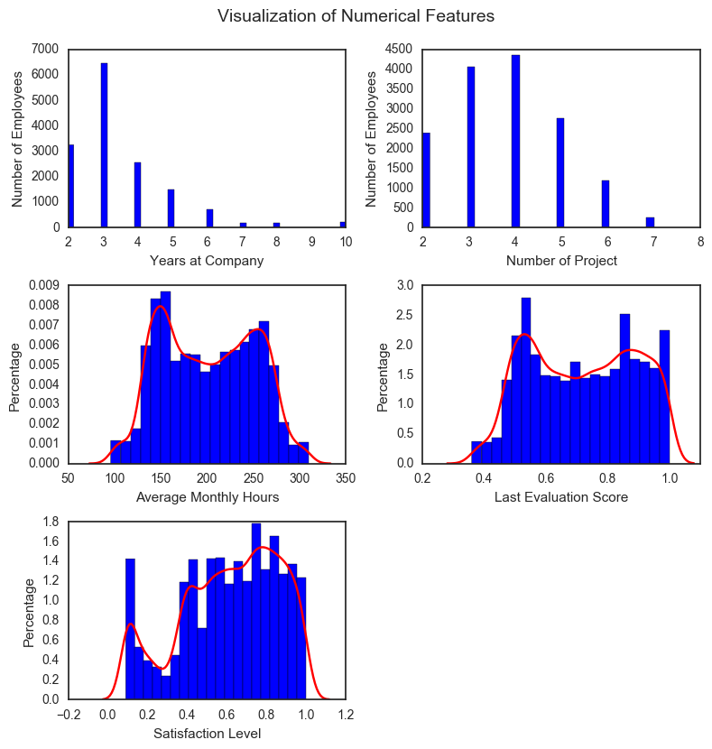
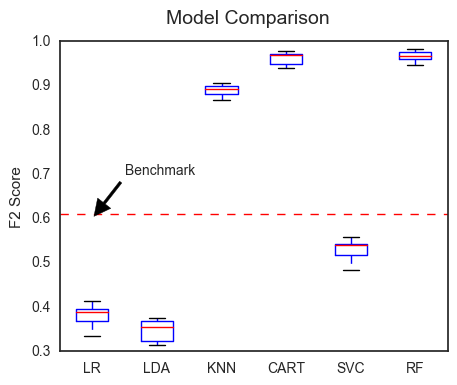
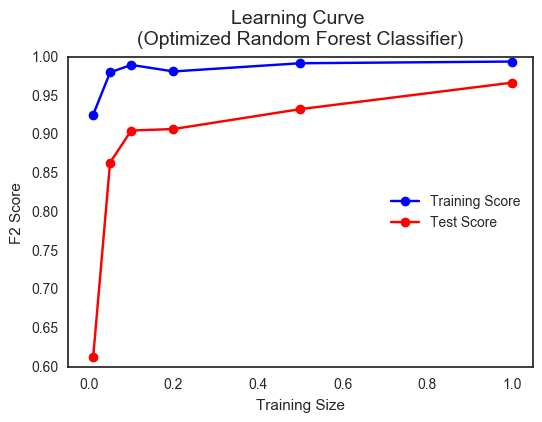
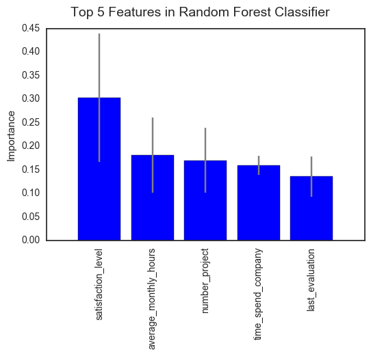

## 1. Introduction    

### 1.1 Background  
Recruiting excellent employees is one thing, but keeping them is another. While losing employees who are poor performers can have positive effects, high employee turnover rate is generally regarded as bad for the business. It increases expenses since the process of identifying, hiring and training employees is very expensive. Studies have shown that cost related to directly replacing an employee can be as high as 50–60% of the employee’s annual salary, and the total cost of turnover can reach as high as 90–200% of the employee’s annual salary.[1] Even worse, frequent employee turnover can destroy the company morale, resulting in decreased performance in the workplace. Therefore, retaining its valuable and talented employees is vital to a company's success.  

A novel approach to implementing an effective retention program and preventing key workers from leaving prematurely is to use machine learning techniques. For example, a supervised classification model can be trained on a dataset containing features related to the employees and whether they left the company (a dataset that is available to many companies). Building such a model provides insights to key factors that result in employee turnover. It also allows the management and the human resource team to predict which employee is going to leave so that they could intervene immediately.  

### 1.2 Problem Statement    
The goal of this project is to build a supervised binary classification model. A simulated dataset containing a series of employee-related features and a binary class label of whether the employee left or not is used. This dataset is available in [**Kaggle**](https://www.kaggle.com/ludobenistant/hr-analytics). 

By building a such classification model with this dataset, the expected outcome of this project is to help the management and the human resource team:  
  
1. predict which current employee is going to leave (class label) so that they could intervene immediately;
2. identify which are the most important factors (features) that lead to employee turnover so that changes can be implemented to ensure employees remain in place while maintaining high work performance and productivity.  

### 1.3 Metrics 

Typically, the performance of a classification model can be measured by accuracy, which is defined as the number of correct predictions from all the predictions made. But in this case, it is not the best metric due to the class imbalance (~25% class 'left' vs ~75% class 'stay'). Instead, we can use a combination of precision and recall as an unambiguous way to show the prediction results of the classifiers. Precision is the number of True Positives (TP) divided by the number of True Positives (TP) and False Positives (FP). A low precision indicates a large number of False Positives.    

$$ precision = \frac{TP}{TP + FP} $$ 

Recall is the number of True Positives (TP) vdivided by the number of True Positives (TP) and the number of False Negatives (FN). A low recall indicates a large number of False Negatives. 

$$ recall = \frac{TP}{TP + FN} $$ 

In this specific problem, we would rather make false positive predictions than false negative ones, i.e., we want to avoid predicting valuable employees who are actually leaving as staying and thus taking no actions. Therefore, a better metric for this problem is the so-called F2 score. It is a weighted average of precision and recall, and is defined as the follows. Note that $\beta$ is is the parameter that controls the weighting balance between precision and recall. With $\beta$ being 2, the F2 score places more emphasis on recall than precision. 

$$ F_{2} = (1 + \beta^2) \cdot \frac{precision \cdot recall}{\left( \beta^2 \cdot precision \right) + recall}, \beta = 2 $$   

***   
\newpage

## 2. Analysis  

### 2.1 Data Exploration  

The dataset contains 14,999 rows and 10 columns. The first 3 rows of the dataset is displayed below:  

satisfaction_level|last_evaluation|number_project|average_monthly_hours|time_spend_company
------------------|---------------|--------------|---------------------|------------------
0.38              |0.53           |2             |157                  |3
0.80              |0.86           |5             |262                  |6
0.11              |0.88           |7             |272                  |4

work_accident|left |promotion_last_5years|department|salary
-------------|-----|---------------------|----------|-------
0            |1    |0                    |sales     |low
0            |1    |0                    |sales     |medium
0            |1    |0                    |sales     |medium

The features in this dataset include:   

* `'satisfaction_level'`: employee satisfaction level (numerical, float numbers between 0 and 1)
* `'last_evaluation'`: the score from the employee's last evaluation (numerical, float numbers between 0 and 1)
* `'number_project'`: the number of projects the employee worked on (numerical, integers)
* `'average_monthly_hours'`: the average monthly hours the employee spent on work (numerical, integers)
* `'time_spend_company'`: number of year the employee spent at the company (numerical, integers)
* `'work_accident'`: whether the employee had a work accident (categorical, '0' - no, '1' - yes)
* `'promotion_last_5year'`: whether the employee had a promotion in the last 5 years (categorical, '0' - no, '1' - yes)
* `'sales'`: the Department the employee works (categorical, 'sales', 'accounting', 'hr', 'technical', 'support', 'management', 'IT', 'product_mng', 'marketing', 'RandD')
* `'salary'`: the salary of the employee (categorical, 'low', 'medium', 'high')

*Note that we have a combination of numerical features and categorical features.* They need to be treated differently. Some descriptive statistics of the numerical features are shown in the table below:  

numerical features   |count|mean   |std   |min   |25%    |50%    |75%    |max	
---------------------|-----|-------|------|------|-------|-------|-------|-------
satisfaction_level   |14999|0.613  |0.249 |0.090 |0.440  |0.640  |0.820  |1.000 
last_evaluation	     |14999|0.716  |0.171 |0.360 |0.560  |0.720	 |0.870  |1.000
number_project	     |14999|3.803  |1.233 |2.000 |3.000  |4.000  |5.000  |7.000
average_monthly_hours|14999|201.050|49.943|96.000|156.000|200.000|245.000|310.000
time_spend_company	 |14999|3.498  |1.460 |2.000 |3.000  |3.000	 |4.000  |10.000 

The target variable in the dataset is:    
  
* `'left'`: whether the employee has left or not (categorical, '0' - no, '1' - yes)

*Note that the number of employees who left in the dataset is 3571 and is 23.81% of the total employees (14,999).* As discussed above, with the unbalanced class distributions, care must be taken when choosing performance measure for the models. F2 score will be used in order to weight recall higher than precision.  

Also note is that there are no `NaN` values and all the numerical values are within reasonable range. No outliers are detected. 

### 2.2 Exploratory Visualization  

Both the numerical and the categorical features are visualized below.  
    

*Some observations from the numerical features are*:  
  
* `time_spend_company` and `number_project` take integer values. This dataset only considers employees at the company for 2 or more years with 2 or more projects.
* `'average_monthly_hours'`, `'last_evaluation'`, and `'satisfaction_level'` take continuous values. All of them show bimodal distributions.  
  

*Some Observations from the categorical features are*:   
  
* `'work_accident'` and `'promotion_last_5years'` are two-level categorical variables. Both show very unbalanced distribution (with the majority being category 0: no work accident or no promotion in last 5 years)
* `'salary'` has 3 levels: low, medium and high. The salary structure seems to reflect the reality, with the majority of employees having low and medium salaries.
* Employees from 10 different departments are included in the dataset, with the majority of employees from sales, technical and support. This also somewhat reflects the reality in many companies.
\newpage 

A correlation matrix of the dataset (excluding `'department'`) is shown below.  
  

*The correlation matrix shows that:*     
  
* There is a strong negative correlation between `'satisfaction_level'` and `'left'` with a correlation coefficient of -0.39.
* Variables `'number_project'`, `'average_monthly_hours'`, and `'last_evaluation'` show strong positive correlations, which makes sense intuitively.

### 2.3 Algorithms and Techniques 

It is a binary classification problem and there are a number of algorithms available in the `scikit-learn` library. To find the best model for the problem, the following algirithms are used to train the dataset:   
  
1. **Logistic Regression.** Logistic Regression is a go-to method for binary classification problem. Just like a Linear Regression, a Logistic Regression model computes a weighted sum of the input features, but instead of outputting the result directly, it outputs the logistic of the results (a number between 0 and 1 representing the probability that an instance belongs to a particular class). It is a simple and fast method and it provides a probabilistic interpretation of the classification results. It has low variance and so is less prone to overfitting. However, Logistic Regression assumes a linear decision boundary which might not be the case sometimes. Also, parameter estimation in Logistic Regression can be complicated by multicollinearity in the features.
2. **Linear Discriminant Analysis.** Linear Discriminant Analysis is a classification algorithm. It is inherently multiclass but also works well for binary classification problems. The algorithm assumes the data is Gaussian and each attribute has the same variance. It fits the data with a Gaussian density to each class and then uses Bayes Theorem to estimate the probabilities that a new set of inputs belongs to each class. The class that gets the highest probability is the output class. The model can be easily computed, and has no hyperparameters to tune. However, it will fail if the data is significantly non-Gaussian. 
3. **K-Nearest Neighbors.** K-Nearest Neighbors algorithm is a non-parametric method used for both classification and regression. In classification, an instance is classified by a majority vote of its neighbors, i.e., the instance is assigned to the most common class among its k nearest neighbors. It is an instance-based learning, or lazy learning, where the function is only approximated locally and all computation is deferred until classification. It is among the simplest of all machine learning algorithms. A shortcoming of K-Nearest Neighbors algorithm is that it is sensitive to the local structure (noise) of the data. 
4. **Decision Trees.** Decision trees algorithm uses a tree-like model to predict the target values and it is capable of both regression and classification. In the case of classification trees, the leaves of the decision tree structre represent class labels and branches represent conjunctions of features that lead to those class labels. It is simple to understand and interpret. Moreover, it automatically does feature selection and variable screening and thus provides information on feature importance. However, it builds trees with a greedy algorithm where locally-optimal decisions are made at each node which does not guarantee a globally-optimal decision tree. Also, Decision Trees algorithm does not work well when the problem is essentially probabilistic. 
5. **Support Vector Machines.** Support Vector Machines algorithm is a powerful and versitle machine learning algorithm capable of performing linear or nonlinear classification, regression, and outlier detection. It constructs a hyperplane or set of hyperplanes in a high- or infinite-dimensional space. A good separation is achieved by the hyperplane that has the largest distance to the nearest training data point of any class. New examples are then mapped into the same space and are predicted to belong to a class based on which side of the hyperplane they fall. It is effective in high dimensional spaces. Also, it is memory efficient by using a subset of training points in the decision function. However, Support Vector Machines classification does not directly provide probability estimates since it is a non-probabilistic classifier. 
6. **Random Forest.** Random Forest algorithm is an ensemble learning method for both classification and regression. In classification tasks, it works by constructing a multitude of random decision trees at training time and outputting the class that is the mode of the classes of the individual trees. It thus corrects the overfitting problem in decision tree, resulting in high classification accuracy. Like Decision Trees, it automatically learns feature interactions and output feature importance. A downside of Random Forest algorithm is that it is computationally expensive than simple Decision Trees and the result is not as easy to interpret. 

All the algorithms will be evaluated out-of-box, i.e., default hyperparameters will be used. For the results to be reproducible, a random seed of 0 is used for Logistic Regression, Decision Tree, Support Vector Machines, and Random Forest. 

In order to evaluate each algorithm, a 10-fold cross validation procedure is used. The dataset is evenly divided into 10 pieces. The model is trained using 9 pieces as the training set and a validation score (F2 score) is obtained from the 1 piece that is held out. By repeating the process 10 times (with a different piece serving as the validation set each time), an average validation score is obtained. Note that k-fold cross validation in default does not shuffle the data into a random order when creating the training and testing subsets. In order to remove any bias in the ordering of the dataset, the `'shuffle'` parameter is set to `True` and a random seed of 0 is used to ensure that the same splits are performed so that each algorithm is evaluated in the exact same way. 

### 2.4 Benchmark  

A naive benchmark model for this problem would be to predict that all the employees are leaving. In other words, the management and HR team treat every single employee as if he/she is leaving. The F2 score for this naive classifier is **0.6097**. Note that implementing such a naive classifier will probably lower the employee turnover rate but most of the time, it is not a realistic retention program for most companies. Nevertheless, we can use this naive classifier as a benchmark to compare with our solution models. 

***  

## 3. Methodology  

### 3.1 Data Preprocessing  

Before the dataset can be used to train classificatin models, some preprocessing steps need to be done, including:  

1. One-hot encoding of the categorical features.  
As shown above, there are 4 categorical features, namely `'work_accident'`, `'promotion_last_5years'`, `'department'` and `'salary'`. One-hot encoding transforms categorical features to a numerical format that works better with learning algorithms. It creates a "dummy" variable for each possible category of each non-numeric feature. For example, after one-hot encoding, the `'wrok_accident'` feature is encoded into `'wrok_accident_0'` and `'work_accident_1'`, each being a boolean column with values 0 or 1. The total number of features in this dataset becomes **22** after one-hot encoding.  

2. Normalization of the numerical features. 
Feature scaling or normalization is a method used to standardize the range of numerical features. As shown above, there are 5 numerical features in the dataset and they take values in various different ranges. In order to make sure that each feature is treated equally when applying supervised learners, `'MinMaxScaler'` from the `scikit-learn` library is used to scale each feature to a range between 0 and 1.     

**Note that step 1 is done with the entire dataset before building any models but step 2 is done for each fold in the cross validation cycle.** This is because when normalizing the entire dataset, the full distribution of data like min and max or mean and standard deviation can be leaked into the rescaled values. Therefore, in order to prevent data leakage, the feature normalization was re-done within each fold of the cross validation. A pipeline is used to automate the feature normalization and model building processes in each iteration of k-fold cross validation procedure.  

### 3.2 Implementation  

The detailed implementation is outlined below with Python code shown:   
  
1. Create transformer class for feature scaling   
As mentioned above, the numerical features need to be normalized so that each feature is treated by the learners equally. But in order to prevent data leakage, such transformation should be done in each fold of the cross validation. A simple way to automate this is to incorporate the feature normalization step in a pipeline. Therefore, a transformer class is built here which can be used for pipeline construction. The transformer takes a list of numerical column names and rescales the numerical columns with the `'MinMaxScaler'` function from `scikit-learn`. The non-numerical features are kept unchanged. 

2. Create pipelines combining the transformer class and each estimator   
With the feature transformer class created in the previous step, we can now build pipelines using the `'make_pipeline'` function in `scikit-learn` by incorporating the transformer as the first step and an estimator of interest (one of the 6 candidate algorithms) as the second step. These pipelines allow sequential application of feature transformation and estimator learning.

3. Define F2 scoring metric   
As introduced previously, F2 score will be used as the performance measure of the models. Here, the scoring metric is defined with the `'make_scorer'` function from `scikit-learn` so that we can later pass it to the cross validation process.

4. Evaluate each model with k fold cross validation and the defined F2 metric   
10-fold cross validation is used to evaluate the models. The cross validation scores are obtained from the `'cross_val_score'` function in `scikit-learn` by passing the previously defined F2 scoring metric. For each model (pipeline), the feature transformation and model learning is carried out in the training set which contains 9 folds of the data. The remaining 1 fold serves as the test set. Feature transformation is done on the test set followed by predition of the class labels. The final output is the F2 score of the prediction. This procecess repeats 10 times resulting in 10 test F2 scores for each model. The models can then be compared by creating boxplots with all cross validation scores, as shown below. The F2 score of the benchmark model is also plotted as a baseline.     
  

Based on the comparison, Decision Trees classifier and Random Forest both perform very well. They give much better F2 score than the benchmark classifier. Generally, Random Forest algorithm is less likely to overfit the data compared to Decision Trees. So in this case, it is chosen as the best model.  

### 3.3 Refinement   

`GridSearchCV` is used to fine tune the chosen model. By specifying a parameter grid with hyperparameter values to experiment with, we can use `GridSearchCV` to evaluate all possible parameter combinations using cross validation. The best combination of parameters which give the best evaluation score is determined. 

In the case of Random Forest, one hyperparameter to tune is `'n_estimators'`, which is the number of trees to build before taking the maximum voting or averages of predictions. Higher number of trees gives better performance but makes the model slower. Possible values of 10, 20, and 50 are specified. The other hyperparameter is `'min_samples_split'`, which is the minimum number of samples required to split an internal node. A smaller number makes the model more prone to capturing noise in train data. Possible values of 2, 5, 10 and 50 are passed to the parameter grid. By running `GridSearchCV`, the best parameter combination turns out to be `'n_estimators'` of 50 and `'min_samples_split'` of 2. The best 10-fold cross validation F2 score is 0.9754, which shows slight improvevment than the score from the out-of-box Ramdom Forest model (0.9660).  
   
***  
   
## 4. Results  

### 4.1 Model Evaluation and Validation  

Based on the model comparison plot above, Random Forest classifier is chosen since it gives the best F2 score. After fine tuning the hyperparameters, the final Random Forest classifier (constructed with 50 random decision trees) gives an even higher F2 score. 

To determinine the robustness of the final model, the discrepency between training score and test scores is evaluated by first randomly splitting the original dataset to 20% test set and 80% training set and then training the model with different training size. The learning curves for training and testing are compared below. The learning curves converge as the number of training points increases. With 100% of the training data (80% of the original dataset) used for training the model, the training score and the test score are close, indicating that the model generalizes well to unseen data.  
  
\newpage
With the Random Forest model trained on all the training data, a confusion matrix of the prediction on the test set is obtained, as shown below. Each column of the matrix represents the instances in a predicted class while each row represents the instances in an actual class.  

0 (predicted) | 1 (predicted)
--------------|--------------
 2294 (TN)    | 5 (FP)
 20 (FN)      | 681 (TP)

The above prediction results indicate precision of 0.9927 and recall of 0.9715. 

Overall, the final Random Forest model generalizes well to unseen data. It gives a much higher F2 score than the benchmark model. As discussed above, the benchmark model is not realistic although it might help to reduce employee turnover rate. The Random Forest classifier, however, is able to correctly identify over 97% of the employees who are leaving. Furthermore, the precision of the prediction is not sacrificed with the high recall. Instead, over 99% of precision is achieved. So, with this synthesized dataset, the Random Forest model performs extremely well.   

However, this kind of results seem too good to be true in reality. But data leakage should not be a problem here since feature normalization is performed on each fold of cross validation instead of on the entire dataset. So, one possible explanation for this exceptionally good result could be that the synthesized dataset is just too ideal. The real-world data is normally a lot messier. Also, it is reasonable to believe that employee turnover characteristic would be different for each individual company, or at least for each type of industry. Therefore, this specific model obtained here is likely not suitable for specific companies out there. Nevertheless, the general machine learning approach described here should be a good practice in reality.      

***   

## 5. Conclusion

### 5.1 Feature Importance    

With a classification model like the Random Forest classifier built above, management and human resource team are now able to predict if a current employee is leaving so that they can take immediate internvention. Another key information for an effective employee retention program is the knowledge of the most important factors on employee turnover. Luckily, with Random Forest classifier, we can easily obtain the feature importance from a trained model. A barplot of the top 5 features from the optimized Random Forest model trained on the entire training set is shown below.   

Thses 5 features consists about **95%** of the total feature importance. `'satisfaction_level'` is determined to be the most important feature, which is consistant with its high correlation coefficient with the target variable `'left'` as shown in the correlation matrix. The other features highly relevant to employee turnover are `'average_monthly_hours'`, `'number_project'`, `'time_spend_company'`, and `'last_evaluation'`.   
  

We can also use three out of the top 5 features to create a 3D visualization.  For example, a 3D visualization using features including `'satisfaction_level'`, `'average_monthly_hours'` and `'last_evaluation'` reveals an interesting fact, that is the majority of employees who left belong to three distinct groups categorized as:  
  
* **Burnt-out employees**: these employees work the most hours. They received high evaluation scores but they are among those who feel least satisfied. These are motivated and competent employees. *They could potentially be excellent performers but the current role is probably a bad fit for them.*
* **Poor performers**: these employees have low evaluation scores. They spend the least time working and they do not feel very satisfied. *Losing this type of employees might be a good thing for the company but a large number of employees in this category is certainly a red flag for the company.*
* **Excellent performers**: these employees work hard and receive high evaluations. Most importantly, they have very high satisfaction level but they still chose to leave. These employees are the most valuable to the company. *They most likely leave because they need better opportunities for career development.*
    

How is the knowledge of the most important features and the different types of employees who left relevant to a successful retention program?   

First of all, management and human resource team should pay extra attention to employees who are working longer hours/working on more projects and are receiving high evaluation scores. They are the most valuable contributors to the company but they are also at high risk of leaving, especially those with low satisfaction level. Replacing these employees is likely going to cost a lot for the company. Second, raising the employee's satisfaction level should always be a key mission for a company. But high satisfaction level does not mean that the employee will stay with you. Excellent performers often choose to leave when the job is not challenging enough or does not provide enough career development, even if they still show high satisfaction level. Last but not least, companies need to monitor the number of "poor performers". A large number or a quick increase of this number is usually a red flag.     

### 5.2 Reflection  

To summarize, this project outlines a machine learning approach to help implement an effective employee retention program. A synthesized dataset containing both numerical and categorical features of the employees, as well as a binary label of whether the employee left or not is used to build a binary classification model. The categorical features are transformed to numerical values by one-hot encoding. The numerical features are rescaled to the same range (0 to 1) so that the learners can treat each feature equally. Different classification algorithms including Logistic Regression, Linear Discriminant Analysis, Decision Trees, K-nearest Neighbors, Support Vector Machines, and Random Forest are compared. The performance of the models are measured by the F2 score in order to put more weights on recall. K fold cross validation procedure is implemented to evaluate the models. Random Forest classifier is chosen as it gives the best cross validation F2 score. The model is further tuned using `GridSearchCV`. The final model shows excellent F2 score (much better than the naive benchmark classifier) and appears to be generalizable to unseen data. With this classification model, we can predict whether a current employee will leave given the features of the employee. Feature importance analysis reveals the top 5 features, which consist about 95% of the total importance. These top features can help management and human resource team understand why their emplpyees leave.  

One potential issue for this kind of problem is the class imbalance in the dataset. In this particular dataset, the minory class (class of employees who left) consists of less than 25% of the entire dataset. This class imbalance is almost always the case because of the nature of employee turnover. Sometimes, this number can be even smaller, e.g., below 10%. Such class imbalance requires a careful selection of performance metric. As discussed earlier, accuracy is not the metric to use when working with imbalanced dataset. Instead, performance measures that give more insight into the prediction results include precision, recall, or the weighted average of the two, e.g., F2 score. Other approaches for dealing with imbalanced dataset are oversampling (when the minority class is oversampled), undersampling (when the majority class is undersampled), and Synthetic Minority Over-sampling Technique (creating synthetic samples from the minority class). 

### 5.3 Improvement  

The final model trained on this specific synthesized dataset shows excellent prediction performance. However, as discussed above, the results seem too good to be true. The real-world dataset is likely to be much messier. To obtain a more realistic performance measure for this kind of supervised learning approach, I think one way is to add random noise to the current dataset.   

Besides, the current model predicts the class labels: left or stay. An alternative is to output the class probability instead of the class label. This affords the management and human resource teams more flexibility as they can specify a customized probability threshold when deciding on intervention. But in this case, a log-loss metric needs to be used instead of the F2 score.      

Also, there are more features relavent to this kind of problem in addition to the ones given in the dataset. Such features include, for example, the employee performance change as shown by the difference between an employee's last evaluation score and his/her average evaluation score, or the number of leaves the employee takes in the past 6 months, etc.   

Finally, as mentioned above, I believe that each company is different in terms of employee turnover. If possible, companies should use the real employee turnover data from the company or create synthesized dataset by incorporating characteristics unique to the company.   

-----------  

*[1] Cascio, W.F. 2006. Managing Human Resources: Productivity, Quality of Work Life, Profits (7th ed.). Burr Ridge, IL: Irwin/McGraw-Hill. Mitchell, T.R., Holtom, B.C., & Lee, T.W. 2001. How to keep your best employees* 